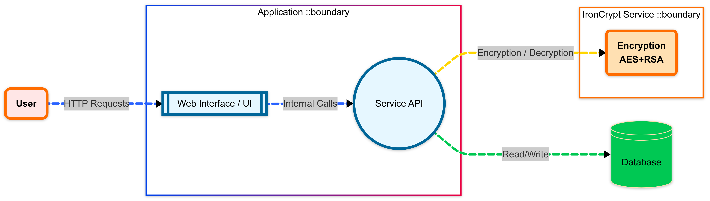

# IronCrypt

**IronCrypt** is a command-line tool and Rust library for secure data encryption. It uses a combination of **Argon2** for password hashing, **AES-256-GCM** for symmetric encryption, and **RSA** for asymmetric key management, providing a robust solution for protecting sensitive data, including passwords and files.

This tool is ideal for developers who need to secure data in applications, manage encryption keys, and perform encryption tasks from the command line.

## Features

- **Hybrid Encryption (RSA + AES):** IronCrypt uses a smart combination of encryption methods. It encrypts your data with AES-256 (very fast and secure), and then encrypts the AES key itself with RSA. This is an industry-standard technique called "envelope encryption" that combines the best of both worlds: the speed of symmetric encryption and the secure key management of asymmetric encryption.
- **State-of-the-Art Password Hashing:** For passwords, IronCrypt uses Argon2, currently considered one of the most secure hashing algorithms in the world. It is specifically designed to resist modern GPU-based brute-force attacks, providing much greater security than older algorithms.
- **Advanced Key Management:** The built-in key versioning system (`-v v1`, `-v v2`) and the dedicated `rotate-key` command allow you to update your encryption keys over time. This automates the process of migrating to a new key without having to manually decrypt and re-encrypt all your data.
- **Flexible Configuration:** You can finely tune security parameters via the `ironcrypt.toml` file or the `IronCryptConfig` struct. This includes RSA key size and the computational "costs" of the Argon2 algorithm, allowing you to balance security and performance to fit your needs.
- **Comprehensive Data Encryption:** IronCrypt is built to handle more than just passwords. It can encrypt any file (images, PDFs, documents), entire directories (by archiving them first), or any other data that can be represented as a stream of bytes.
- **Dual Use (CLI and Library):** IronCrypt is designed from the ground up to be dual-purpose. You can use it as a quick command-line tool for simple tasks, or integrate it as a library (crate) directly into your own Rust applications for more complex logic.

## Workflow

The following diagram illustrates the general encryption and decryption workflow in IronCrypt:



## Installation

You can install IronCrypt by compiling it from the source.

### Prerequisites

- **Rust** (latest stable version recommended)
- **Cargo** (Rust's package manager)

### Building and Running from Source

There are three main ways to run the `ironcrypt` command-line tool.

#### 1. Using `cargo run` (Recommended for development)
This command compiles and runs the program in one step. Use `--` to separate `cargo`'s arguments from your program's arguments.
```sh
# Clone the repository
git clone https://github.com/teamflp/ironcrypt.git
cd ironcrypt

# Run the --help command
cargo run -- --help
```

#### 2. Building and running the executable directly
You can build the executable and then run it from its path in the `target` directory. Note that on some systems (like macOS), the exact path might include your system's architecture (e.g., `target/x86_64-apple-darwin/release/`).
```sh
# Build the optimized release executable
cargo build --release

# Run it from its path
./target/release/ironcrypt --help
```

#### 3. Installing the binary (Recommended for usage)
This will install the `ironcrypt` command on your system, making it available from any directory. This is the best option for regular use.
```sh
# From the root of the project directory, run:
cargo install --path .

# Now you can use the command from anywhere
ironcrypt --help
```

## Configuration

IronCrypt can be configured using an `ironcrypt.toml` file in the directory where you run the command. You can create this file by copying the provided example:

```sh
cp ironcrypt.toml.example ironcrypt.toml
```

You can then edit `ironcrypt.toml` to customize settings like RSA key size, Argon2 parameters, and password complexity rules.

### Environment Variables
Alternatively, many command-line options can be configured via environment variables. This is especially useful in CI/CD or containerized environments.

| Variable | Corresponding Command(s) |
|---|---|
| `IRONCRYPT_KEY_VERSION` | `generate`, `encrypt`, `decrypt`, ... |
| `IRONCRYPT_KEY_DIR` | `generate`, `rotate-key` |
| `IRONCRYPT_PUBKEY_DIR` | `encrypt`, `encrypt-file`, `encrypt-dir` |
| `IRONCRYPT_PRIVKEY_DIR`| `decrypt`, `decrypt-file`, `decrypt-dir` |
| `IRONCRYPT_PASSWORD` | `encrypt`, `decrypt`, ... |
| `IRONCRYPT_INPUT` | `encrypt-file`, `decrypt-file`, ... |
| `IRONCRYPT_OUTPUT` | `encrypt-file`, `decrypt-file`, ... |

*Note: Command-line arguments will always take precedence over environment variables.*

**Example `ironcrypt.toml`:**
```toml
# RSA key size in bits (e.g., 2048, 4096)
rsa_key_size = 2048

# Argon2 parameters for password hashing
argon2_memory_cost = 65536  # in KiB
argon2_time_cost = 3
argon2_parallelism = 1

# Password strength criteria
[password_criteria]
min_length = 12
require_uppercase = true
require_numbers = true
require_special_chars = true
```


### Quick Start: Encrypting and Decrypting a Password

Here is a common workflow for using IronCrypt.

**1. Generate RSA Keys**

First, generate a versioned key pair. The version allows you to manage multiple keys.

```sh
ironcrypt generate -v v1
```

This creates `private_key_v1.pem` and `public_key_v1.pem` in a `keys/` directory.

**2. Encrypt a Password**

Use the `encrypt` command with the public key to hash and encrypt a password.

```sh
ironcrypt encrypt --password "My$ecureP@ssw0rd!" --key-version v1
```

This command creates a file named `encrypted_data.json` containing the encrypted data.

**3. Decrypt and Verify a Password**

To verify a password, use the `decrypt` command. It will use the private key to decrypt the data and compare the stored hash with the provided password.

```sh
ironcrypt decrypt --password "My$ecureP@ssw0rd!" --key-version v1 --file encrypted_data.json
```

If the password is correct, the tool will print a success message.

### All Commands

| Command | Description |
|---|---|
| `generate` | Generates a new RSA key pair (public and private). |
| `encrypt` | Hashes and encrypts a password. |
| `decrypt` | Decrypts data and verifies a password. |
| `encrypt-file` | Encrypts a single file. |
| `decrypt-file` | Decrypts a single file. |
| `encrypt-dir` | Archives and encrypts a directory. |
| `decrypt-dir` | Decrypts and extracts a directory. |
| `rotate-key` | Rotates encryption keys for a file or directory. |

---

### Command Details

#### `generate`
Generates an RSA key pair.
```sh
ironcrypt generate --version <VERSION> [--directory <PATH>] [--key-size <BITS>]
```
- `-v, --version`: (Required) A version for the key (e.g., `v1`).
- `-d, --directory`: The directory to save keys to (default: `keys`).
- `-s, --key-size`: The key size in bits (default: `2048`).

#### `encrypt`
Hashes a password with Argon2, encrypts it with AES, and encrypts the AES key with RSA.
```sh
ironcrypt encrypt --password <PASSWORD> --key-version <VERSION> [--public-key-directory <PATH>]
```
- `-w, --password`: The password to encrypt.
- `-v, --key-version`: The version of the public key to use.
- `-d, --public-key-directory`: The directory where the public key is located (default: `keys`).

#### `decrypt`
Decrypts data and verifies a password against the stored hash.
```sh
ironcrypt decrypt --password <PASSWORD> --key-version <VERSION> --file <PATH> [--private-key-directory <PATH>]
```
- `-w, --password`: The password to verify.
- `-v, --key-version`: The version of the private key to use.
- `-f, --file`: The path to the file containing the encrypted data (e.g., `encrypted_data.json`).
- `-k, --private-key-directory`: The directory where the private key is located (default: `keys`).

#### `encrypt-file`
Encrypts a single file.
```sh
ironcrypt encrypt-file -i <INPUT> -o <OUTPUT> -v <VERSION> [--public-key-directory <PATH>]
```
- `-i, --input-file`: Path to the file to encrypt.
- `-o, --output-file`: Path to write the encrypted output to.
- `-v, --key-version`: The version of the public key to use.

#### `decrypt-file`
Decrypts a single file.
```sh
ironcrypt decrypt-file -i <INPUT> -o <OUTPUT> -v <VERSION> [--private-key-directory <PATH>]
```
- `-i, --input-file`: Path to the encrypted file.
- `-o, --output-file`: Path to write the decrypted file to.
- `-v, --key-version`: The version of the private key to use.

#### `encrypt-dir`
Archives a directory into a `.tar.gz` file and encrypts it.
```sh
ironcrypt encrypt-dir -i <INPUT_DIR> -o <OUTPUT_FILE> -v <VERSION>
```
- `-i, --input-dir`: Path to the directory to encrypt.
- `-o, --output-file`: Path to write the encrypted archive to.
- `-v, --key-version`: The version of the public key to use.

#### `decrypt-dir`
Decrypts and extracts a directory archive.
```sh
ironcrypt decrypt-dir -i <INPUT_FILE> -o <OUTPUT_DIR> -v <VERSION>
```
- `-i, --input-file`: Path to the encrypted archive.
- `-o, --output-dir`: Path to extract the decrypted directory to.
- `-v, --key-version`: The version of the private key to use.

#### `rotate-key`
Re-encrypts a file or all files in a directory from an old key to a new key.
```sh
ironcrypt rotate-key --old-version <OLD> --new-version <NEW> [-f <FILE> | -d <DIRECTORY>]
```
- `--old-version`: The current key version of the file(s).
- `--new-version`: The new key version to re-encrypt with.
- `-f, --file`: A single file to re-encrypt.
- `-d, --directory`: A directory of files to re-encrypt.

## Library Usage (Rust)

You can also use `ironcrypt` as a library in your Rust projects. Add it to your `Cargo.toml`:
```toml
[dependencies]
ironcrypt = { git = "https://github.com/teamflp/ironcrypt.git" }
```

Here is a basic example of how to use the library to encrypt and verify a password:
```rust
use ironcrypt::{IronCrypt, IronCryptConfig, IronCryptError};

fn main() -> Result<(), IronCryptError> {
    // Configure IronCrypt. This will also generate keys if they don't exist.
    let config = IronCryptConfig::default();
    let crypt = IronCrypt::new("keys", "v1", config)?;

    // 1. Encrypt a password
    let password = "My$ecureP@ssw0rd!";
    let encrypted_data = crypt.encrypt_password(password)?;
    println!("Encrypted data: {}", encrypted_data);

    // 2. Verify the password
    let is_valid = crypt.verify_password(&encrypted_data, password)?;

    if is_valid {
        println!("Password verification successful!");
    } else {
        println!("Password verification failed.");
    }

    // 3. Verify an incorrect password
    let is_valid_bad = crypt.verify_password(&encrypted_data, "WrongPassword");
    assert!(is_valid_bad.is_err()); // Expects an error for invalid password
    println!("Verification with incorrect password failed as expected.");

    Ok(())
}
```

### Running the Example

This repository includes a complete, runnable example project in the `examples/basic-usage` directory. To run it, you can use the following command from the root of the repository:

```sh
cargo run --example basic-usage
```

This will execute the example code, which demonstrates initializing `IronCrypt`, encrypting a password, and verifying it.

## Security Best Practices

- **Protect Your Private Keys**: Your RSA private keys are the most critical component. Keep them in a secure location with restricted permissions. Do not commit them to version control.
- **Use Strong Passwords**: When using password-based features, enforce strong password policies.
- **Rotate Keys**: Regularly rotate your encryption keys using the `rotate-key` command to limit the impact of a potential key compromise.

## Contributing

Contributions are welcome! If you'd like to contribute, please follow these steps:

1.  **Fork** the repository on GitHub.
2.  **Create** a new branch for your feature or bug fix.
3.  **Commit** your changes and push them to your fork.
4.  **Submit** a pull request with a clear description of your changes.

---
*IronCrypt is licensed under the MIT License. See the [LICENSE](LICENSE) file for details.*