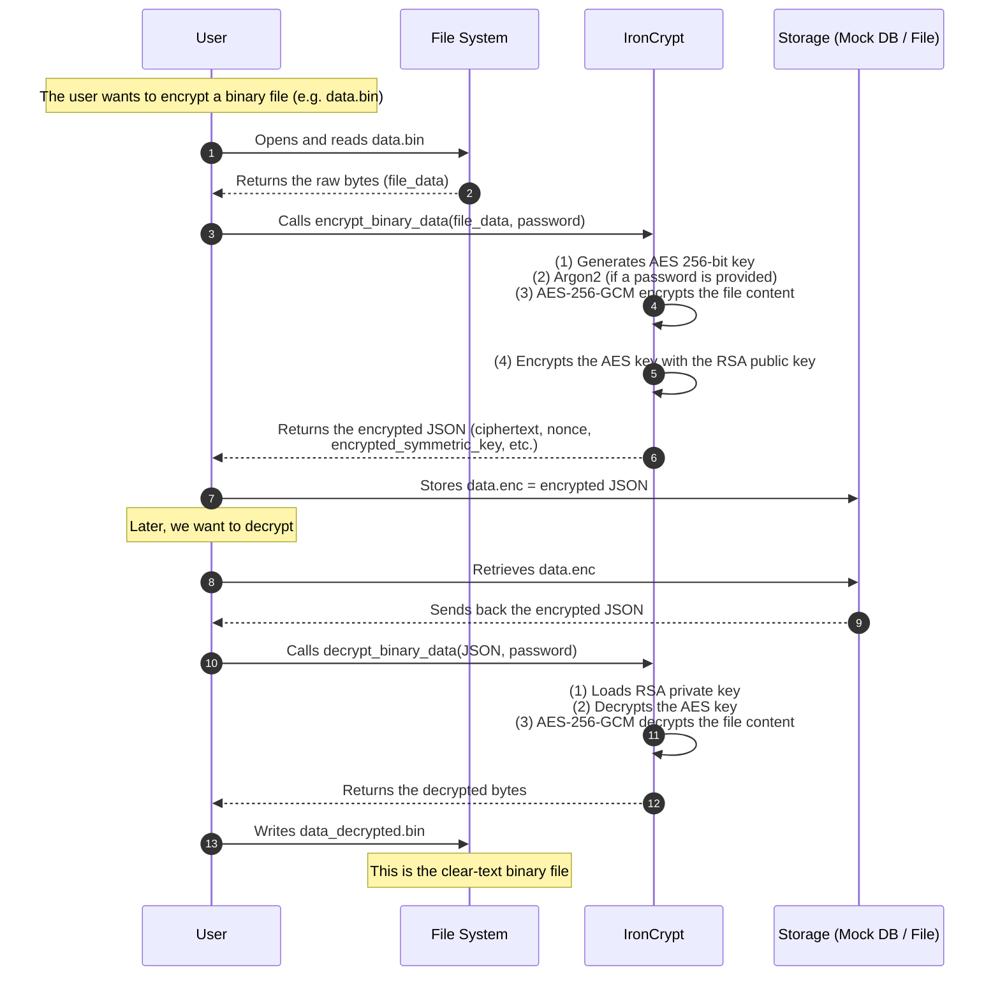

# IronCrypt

- [IronCrypt](#ironcrypt)
  - [Features](#features)
  - [Prerequisites](#prerequisites)
  - [Installation](#installation)
  - [Usage](#usage)
    - [Available Commands](#available-commands)
    - [Below is the general structure of each command.](#below-is-the-general-structure-of-each-command)
    - [Generate](#generate)
    - [Encrypt](#encrypt)
      - [Decrypt](#decrypt)
  - [Examples](#examples)
    - [Generating RSA Keys](#generating-rsa-keys)
    - [Encrypting a Password](#encrypting-a-password)
    - [Decrypting and Verifying a Password](#decrypting-and-verifying-a-password)
    - [Decrypting and Verifying a Password](#decrypting-and-verifying-a-password-1)
  - [Full Example: Password Encryption and Decryption](#full-example-password-encryption-and-decryption)
    - [Steps:](#steps)
  - [Workflows and Architecture Voici deux diagrammes détaillant :](#workflows-and-architecture-voici-deux-diagrammes-d%C3%A9taillant-)
    - [A) Encryption/Decryption Workflow Flowchart:](#a-encryptiondecryption-workflow-flowchart)
  - [Error Handling](#error-handling)
  - [Encrypting and Decrypting Binary Files](#encrypting-and-decrypting-binary-files)
    - [Workflow for Binary Files](#workflow-for-binary-files)
    - [**Encrypt** it:](#encrypt-it)
  - [Table of Commands and Options](#table-of-commands-and-options)
  - [Security and Best Practices](#security-and-best-practices)
  - [Contribution](#contribution)

**IronCrypt** is a Command-Line Interface (CLI) tool and Rust library dedicated to secure password and data encryption. By combining the **Argon2** hashing algorithm, **AES-256-GCM** encryption, and **RSA** for key management, IronCrypt provides a robust solution to ensure your application’s data confidentiality and password security.

---

## Features

- **Password Strength Verification**: Enforces robust criteria (length, uppercase letters, numbers, special characters).
- **Secure Password Hashing**: Uses **Argon2** for hashing to protect against brute-force attacks.
- **Data Encryption**: Secures hashed passwords with **AES-256-GCM**.
- **Asymmetric Key Encryption**: Employs **RSA** (OAEP with SHA-256) to securely handle AES keys.
- **Password Decryption and Verification**: Decrypts stored data and verifies user passwords.
- **RSA Key Management**: Generates, saves, loads RSA key pairs in PEM format.
- **Intuitive CLI**: Simple commands to manage RSA keys and encryption.
- **Flexible Rust API**: Straightforward integration with Rust-based applications (web backends, desktop apps, etc.).

---

## Prerequisites

- **Rust** ≥ `1.56`
- **Cargo** (Rust’s package manager)

If you plan to build from source or develop with IronCrypt’s library functions, ensure you have these dependencies in your `Cargo.toml` (versions may vary):

```toml
[dependencies]
serde = { version = "1.0", features = ["derive"] }
argon2 = "0.5.3"
base64 = "0.22.1"
rsa = { version = "0.9.6", features = ["pem"] }
serde_json = "1.0"
sha2 = "0.10.6"
rand = "0.8.5"
rand_chacha = "0.3.1"
rand_core = "0.6.4"
clap = { version = "4.5.20", features = ["derive"] }
thiserror = "1.0.64"
indicatif = "0.17.8"
aes-gcm = "0.10.3"
tar = "0.4"
flate2 = "1.0"
```

## Installation

Add `IronCrypt` to your project using `cargo`:

```bash
cargo add ironcrypt
```

You can add IronCrypt directly to your Rust project by adding the following line to your `Cargo.toml`:

```toml
[dependencies]
ironcrypt = "0.1..."
```

Or install locally from a Git repository:

```rust
[dependencies]
ironcrypt = { git = "https://github.com/teamflp/ironcrypt.git" }
```

Finally, run:

```bash
cargo build
```

to compile your project with IronCrypt included.

## Usage

IronCrypt offers a **Command-Line Interface** with several commands to manage RSA keys and perform password encryption/decryption, **and** also provides a **Rust API** for deeper integration in your applications.

### Available Commands

| **Command** | **Description** |
| --- | --- |
| `generate` | Generates an RSA key pair (private and public). |
| `encrypt` | Hashes and encrypts a password using a public key. |
| `decrypt` | Decrypts encrypted data and verifies a password. |
| `encrypt-file` | Encrypts a single file. |
| `decrypt-file` | Decrypts a single file. |
| `encrypt-dir` | Encrypts a directory into a single archive. |
| `decrypt-dir` | Decrypts and extracts a directory archive. |
| `rotate-key` | Rotates an encryption key and re-encrypts data. |

### Below is the general structure of each command.

### Generate

Generates an RSA key pair. This allows key rotation by storing separate `private_key_vX.pem` and `public_key_vX.pem`files for each version.

**Syntax:**

```bash
cargo run -- generate -v <version> -d <directory> -s <key_size>
```

| **Option** | **Short** | **Description** | **Default** |
| --- | --- | --- | --- |
| `--version` | `-v` | Version identifier for the key pair. | *(required)* |
| `--directory` | `-d` | Directory path where keys will be saved. | `keys` |
| `--key_size` | `-s` | Size of the RSA key in bits (2048, 4096...). | `2048` |

**Exemple :**

```bash
cargo run -- generate -v v1 -d keys -s 4096
```

This command generates a 4096-bit RSA key pair with version v1, placing the files in the `keys` directory:

- `keys/private_key_v1.pem`
- `keys/public_key_v1.pem`

### Encrypt

Hashes and encrypts a password (Argon2 + AES + RSA). For example:

```bash
cargo run -- encrypt 
    --password "MySecureP@ssw0rd" 
    --public_key_directory keys 
    —key_version v1
```

Or:

```bash
cargo run -- encrypt -w "Myp@ssword001" -d keys -v v1
```

**Output**:

```json
{
  "key_version":"v1",
  "encrypted_symmetric_key":"PL0I8E+...",
  "nonce":"iaDq0gcDYZk=",
  "ciphertext":"Z7saFqL...Vk="
}
```

Copier

#### Decrypt

*(Note: This heading is maintained from the existing ToC structure, but see below for full command usage.)*

The `decrypt` command decrypts the encrypted data (containing the hashed password) and verifies if the provided password matches. You can supply the encrypted data either directly as a string or via a file.

Decrypts the JSON blob, retrieves the AES key (via RSA private key), decrypts the hashed password, and verifies it:

```bash
cargo run -- decrypt 
    --password "MySecureP@ssw0rd" 
    --private_key_directory keys 
    --data '{"key_version":"v1","encrypted_symmetric_key":"PL0I8E+...","nonce":"iaDq0gcDYZk=","ciphertext":"Z7saFqL..."}'
```

Or from a file:

```bash
cargo run -- decrypt -w "MySecureP@ssw0rd" -v v1 -k keys -f encrypted_data.json
```

If the password matches, you’ll see:

```plaintext
The password is correct.
```

Otherwise:

```bash
The password is incorrect or an error occurred...
```

## Examples

Below are some quick usage examples covering **key generation**, **password encryption**, and **password decryption**.

### Generating RSA Keys

```bash
cargo run -- generate -v v1 -d keys -s 4096
```

Output (example):

```vbnet
⠋ Generating RSA keys...
✔ RSA key generation completed.
RSA keys have been successfully generated and saved.
Private Key: keys/private_key_v1.pem
Public Key: keys/public_key_v1.pem
```

### Encrypting a password

Use the `encrypt` command to hash a password with Argon2, then encrypt it with AES, and finally encrypt the AES key with RSA:

```bash
cargo run -- encrypt 
    --password "MySecureP@ssw0rd" 
    --public_key_directory keys 
    --key_version v1
```

Or use :

```bash
cargo run -- encrypt -w "Myp@ssword001" -d keys -v v1
```

### Decrypting and verifying a password

```plaintext
cargo run -- decrypt 
    --password "MySecureP@ssw0rd" 
    --private_key_directory keys 
    --file /path/to/encrypted_data.json
```

**Options:**

| **Option** | **Short** | **Description** | **Default** |
| --- | --- | --- | --- |
| `--password` | `-w` | The password to hash and encrypt. | *(required)* |
| `--public_key_directory` | `-d` | Directory path containing the public key file. | `keys` |
| `--private_key_directory` | `-k` | Directory path containing the private key file. | `keys` |
| `—-file` | `-f` | File containing the data encrypted (JSON) | `file` |
| `--key_version` | `-v` | The version identifier of the public key to use. | *(required)* |

**Output (example)**:

```json
{
  "key_version":"v1",
  "encrypted_symmetric_key":"PL0I8E+...",
  "nonce":"iaDq0gcDYZk=",
  "ciphertext":"Z7saFqL...Vk="
}
```

Store this JSON string (usually encoded as a single Base64 or JSON) in your database.

### Decrypting and verifying a password

Use the `decrypt` command to decrypt the data and verify a password.
You can pass the encrypted data via `-d` (inline) or `-f` (file).

**Inline example**:

```bash
cargo run -- decrypt 
    --password "MySecureP@ssw0rd" 
    --private_key_directory keys 
    --data '{"key_version":"v1","encrypted_symmetric_key":"PL0I8E+...","nonce":"iaDq0gcDYZk=","ciphertext":"Z7saFqL..."}'
```

**Or with a file**:

```bash
cargo run -- decrypt 
    --password "MySecureP@ssw0rd" 
    --private_key_directory keys 
    --file /path/to/encrypted_data.json
```

You can use the short code to decrypt :

```bash
 cargo run -- decrypt -w "M@rdochee2008" -k keys -f "encrypted_data.json"
```

Output if the password matches:

```pgsql
The password is correct.
```

If it fails or any error arises, you’ll see a descriptive error message.

### Encrypting and Decrypting a Directory

To encrypt an entire directory, `ironcrypt` will first archive it as a `.tar.gz` file in memory, then encrypt the archive.

**Encrypt a directory:**
```bash
cargo run -- encrypt-dir -i ./my_secret_files -o my_secret_files.enc -v v1
```

**Decrypt a directory:**
```bash
cargo run -- decrypt-dir -i ./my_secret_files.enc -o ./my_restored_files -v v1
```

### Key Rotation

`ironcrypt` supports key rotation, allowing you to migrate your encrypted files from an old key to a new one without ever decrypting the data on disk.

**Rotate a key for a single file:**
```bash
cargo run -- rotate-key --old-version v1 --new-version v2 -f ./encrypted_data.json
```

**Rotate a key for an entire directory of encrypted files:**
```bash
cargo run -- rotate-key --old-version v1 --new-version v2 -d ./encrypted_files_directory
```

## Full example: Password encryption and decryption

Below is a concise Rust code example demonstrating **end-to-end** usage of IronCrypt in a single process (though typically you’d store the resulting encrypted data in a database for later retrieval).

```rust
use ironcrypt::{
  IronCrypt, IronCryptConfig, IronCryptError,
  PasswordCriteria,
};
use std::collections::HashMap;
use std::error::Error;

/// Mock database table: username -> encrypted JSON
type MockDatabase = HashMap<String, String>;

/// Represents the API service that handles business logic
/// (database interactions, encryption/decryption via IronCrypt).
struct ServiceAPI {
  db: MockDatabase,
  crypt: IronCrypt,
}

impl ServiceAPI {
  /// Creates the service by initializing IronCrypt (which generates or ensures RSA keys)
  /// and an in-memory "database" (HashMap).
  fn new(key_directory: &str, key_version: &str) -> Result<Self, IronCryptError> {
    // Prepare the config (RSA key size, Argon2 params, PasswordCriteria, etc.).
    let config = IronCryptConfig::default();
    let crypt = IronCrypt::new(key_directory, key_version, config)?;

    let db = HashMap::new(); // In-memory "database"
    Ok(ServiceAPI { db, crypt })
  }

  /// Encrypts the user's password and stores it in the mock DB.
  fn create_user(&mut self, username: &str, plain_password: &str) -> Result<(), IronCryptError> {
    let encrypted_json = self.crypt.encrypt_password(plain_password)?;
    self.db.insert(username.to_owned(), encrypted_json);
    Ok(())
  }

  /// Verifies the user's provided password (if the user exists).
  fn verify_user(&self, username: &str, password_attempt: &str) -> Result<bool, IronCryptError> {
    if let Some(stored_json) = self.db.get(username) {
      // Decrypt and compare the password
      self.crypt.verify_password(stored_json, password_attempt)
    } else {
      // No user found => you can handle differently or return an error
      Err(IronCryptError::InvalidPassword)
    }
  }
}

/// Simulates the Web/UI layer that calls the ServiceAPI methods.
struct WebInterface<'a> {
  service: &'a mut ServiceAPI,
}

impl<'a> WebInterface<'a> {
  fn new(service: &'a mut ServiceAPI) -> Self {
    WebInterface { service }
  }

  /// Simulates a "Create Account" form where the user chooses a password.
  fn register_form(&mut self, username: &str, plain_password: &str) {
    println!("(UI) User '{}' is creating an account...", username);
    match self.service.create_user(username, plain_password) {
      Ok(_) => println!("(UI) Successfully created account for '{}'.", username),
      Err(e) => println!("(UI) Error creating user '{}': {:?}", username, e),
    }
  }

  /// Simulates a "Login" form where the user attempts to log in.
  fn login_form(&self, username: &str, password_attempt: &str) {
    println!("(UI) User '{}' attempts to log in...", username);
    match self.service.verify_user(username, password_attempt) {
      Ok(valid) => {
        if valid {
          println!("(UI) Correct password! Access granted.");
        } else {
          println!("(UI) Wrong password!");
        }
      }
      Err(e) => println!("(UI) Error verifying '{}': {:?}", username, e),
    }
  }
}

/// Main entry point simulating the end-to-end flow (User -> UI -> Service -> DB / IronCrypt).
fn main() -> Result<(), Box<dyn Error>> {
  // ------------------------------ Setup --------------------------------
  // Initialize the ServiceAPI + DB + IronCrypt
  let mut service_api = ServiceAPI::new("keys", "v1")?;

  // Initialize a "WebInterface" that calls the ServiceAPI
  let mut ui = WebInterface::new(&mut service_api);

  // ------------------------------ Flow ---------------------------------
  // 1) "alice" creates an account
  ui.register_form("alice", "MySup3rSecret!");

  // 2) "alice" tries to log in with the correct password
  ui.login_form("alice", "MySup3rSecret!");

  // 3) Test a wrong password
  ui.login_form("alice", "BadPassword123");

  // 4) Test an unknown user
  ui.login_form("bob", "SomeRandomPwd");

  Ok(())
}
```

### Explanation

1. **User**: Simulated by direct calls to `ui.register_form(...)` or `ui.login_form(...)`. In a real setup, these would come from HTTP requests.
2. **WebInterface**: Mimics the UI layer (frontend) which requests the creation of a user or attempts a login.
3. **ServiceAPI**: Acts as the “service” that orchestrates IronCrypt calls and database storage.
   - *create_user* → uses `encrypt_password(...)` to store a JSON in the DB.
   - *verify_user* → uses `verify_password(...)` to check correctness.
4. **IronCrypt**: Provides all the cryptographic functionalities (Argon2 hashing, AES-256-GCM encryption, RSA key encryption).
5. **Mock Database**: A simple `HashMap`, but in a real system you’d replace it with a real database (SQL, NoSQL, etc.).

## Error handling

**IronCrypt** provides a structured error type `IronCryptError` covering a range of failure modes:

| **Variant**                  | **Description**                                               |
|------------------------------|---------------------------------------------------------------|
| `PasswordStrengthError(msg)` | Password doesn’t meet the specified criteria.                 |
| `HashingError(msg)`          | Errors during Argon2 hashing.                                 |
| `EncryptionError(msg)`       | Errors during AES or RSA encryption.                          |
| `DecryptionError(msg)`       | Errors during AES or RSA decryption.                          |
| `KeyGenerationError(msg)`    | Failures in generating RSA keys.                              |
| `KeyLoadingError(msg)`       | Failures in loading RSA keys from files.                      |
| `KeySavingError(msg)`        | Failures in saving RSA keys to files.                         |
| `IOError(e)`                 | Underlying I/O problems (file read/write).                    |
| `Utf8Error(e)`               | UTF-8 conversion issues.                                      |
| `InvalidPassword`            | The user-provided password does not match the decrypted hash. |

Handle these carefully in production to avoid revealing sensitive information.

## Encrypting and decrypting binary files

In addition to handling password encryption, **IronCrypt** provides two dedicated commands for encrypting/decrypting any binary file:

IronCrypt also supports **binary files**:

1. **EncryptFile** : AES-256-GCM + RSA for the file content/key, serialized as JSON (base64).
2. **DecryptFile**: Reverse process to restore the original binary file.

Commands and options for binary Files

Below is a **summary** focusing on the commands related to binary files. Other commands (`generate`, `encrypt`, `decrypt`) exist but are not listed here.

| **Command**   | **Short**                | **Alias**                                         | **Default**     |
|---------------|--------------------------|---------------------------------------------------|-----------------|
| `encryptfile` | `encfile`, `efile`, `ef` | Encrypts a binary file (AES+RSA) → JSON (base64). | `keys, version` |
| `decryptfile` | `decfile`, `dfile`, `df` | Decrypts that JSON to restore the original file.  | `keys, version` |

**Key Arguments/Options**:

| **Option**                 | **Short** | **Description**                                              | **Default**  |
|----------------------------|-----------|--------------------------------------------------------------|--------------|
| `--input_file <input>`     | `-i`      | Path to the binary file to be encrypted/decrypted.           | *(required)* |
| `--output_file <output>`   | `-o`      | Path of the output file (JSON or decrypted binary).          | *(required)* |
| `--public_key_directory`   | `-d`      | Directory containing the public key (EncryptFile).           | `keys`       |
| `--private_key_directory`  | `-k`      | Directory containing the private key (DecryptFile).          | `keys`       |
| `--key_version <version>`  | `-v`      | Key version (e.g. `v1`, `v2`, etc.).                         | `v1`         |
| `--password <string>`      | `-w`      | Optional string if you wish to enforce a password or Argon2. | *(empty)*    |

### Workflow for binary files



**(Optional)** archive a folder:

```bash
tar -czf my_folder.tar.gz my_folder/
```

**Syntaxe** :

```bash
cargo run -- decryptfile 
    --input_file <encrypted_file.json> 
    --output_file <decrypted_file> 
    --private_key_directory <private_key_dir> 
    --key_version <key_version> 
    --password <optiona
```

Copier

### **Encrypt** it:

```bash
cargo run -- ef 
    --input_file my_folder.tar.gz 
    --output_file my_folder.enc 
    --public_key_directory keys 
    --key_version v1 
    --password "MySecret"
```

**Decrypting a file**:

```bash
cargo run -- df 
    --input_file my_folder.enc 
    --output_file my_folder_decrypted.tar.gz 
    --private_key_directory keys 
    --key_version v1 
    --password "MySecret"
```

> **Note**: **Extract** using `tar -xzf my_folder_decrypted.tar.gz`

Exemple 

```rust
use ironcrypt::{
    IronCrypt, IronCryptConfig, IronCryptError,
};
use std::error::Error;
use std::fs::{File};
use std::io::{Read, Write};
use std::collections::HashMap;

/// Mock storage: filename -> encrypted JSON
type MockFileStorage = HashMap<String, String>;

fn main() -> Result<(), Box<dyn Error>> {
    // 1) Configure IronCrypt (key size, Argon2 params, etc.)
    let config = IronCryptConfig::default();
    // e.g. config.rsa_key_size = 4096; etc.

    // 2) Create IronCrypt instance (ensures RSA keys exist in "keys" with version "v1")
    let key_directory = "keys";
    let key_version = "v1";
    let crypt = IronCrypt::new(key_directory, key_version, config)?;

    // 3) Prepare a mock storage for "encrypted files"
    let mut storage: MockFileStorage = HashMap::new();

    // -------------------- ENCRYPT a file --------------------
    // Let's assume we have a file data.bin we want to encrypt
    let input_filepath = "data.bin";
    let password = "OptionalPass!"; // if you want to enforce Argon2 on the password
    let mut file_data = Vec::new();

    // Read the original file
    {
        let mut f = File::open(input_filepath)?;
        f.read_to_end(&mut file_data)?;
    }

    // Now encrypt the file data
    println!("Encrypting file '{}' ...", input_filepath);
    let encrypted_json = crypt.encrypt_binary_data(&file_data, password)?;
    println!("Resulting encrypted JSON: {}", &encrypted_json[..50.min(encrypted_json.len())]); // show partial

    // Simulate storing that encrypted JSON in a "storage" with a unique key
    storage.insert("data.bin.enc".to_string(), encrypted_json);

    // We can also store it to a real file:
    // std::fs::write("data.bin.enc", &encrypted_json)?;

    // -------------------- DECRYPT the file --------------------
    // Let's retrieve the encrypted JSON from our storage
    if let Some(encrypted_stored) = storage.get("data.bin.enc") {
        println!("Decrypting file ...");
        let decrypted_bytes = crypt.decrypt_binary_data(encrypted_stored, password)?;
        // Then write it to a new file:
        let output_filepath = "data_decrypted.bin";
        let mut out = File::create(output_filepath)?;
        out.write_all(&decrypted_bytes)?;
        println!("Decrypted file written to '{}'.", output_filepath);
    } else {
        eprintln!("Could not find 'data.bin.enc' in storage.");
    }

    Ok(())
}
```

### Explanation of the steps

1. **IronCryptConfig**

   - We start with a default config (which includes RSA key size = 2048 bits, Argon2 memory/time cost, default `PasswordCriteria`, etc.).
   - You can adjust `config.rsa_key_size`, `config.password_criteria`, or Argon2 parameters as needed.

2. **Creating an IronCrypt instance**

   - `IronCrypt::new(key_directory, key_version, config)` ensures you have a `private_key_v1.pem` and `public_key_v1.pem` in the `keys` folder (it will generate them if missing).
   - This instance can encrypt (`encrypt_binary_data(...)`) or decrypt (`decrypt_binary_data(...)`) any data.

3. **Reading the original file** (`data.bin`)

   - We open it and read all bytes into `file_data: Vec<u8>`.

4. **Encrypting the binary data**

   - `crypt.encrypt_binary_data(&file_data, password)` performs:
     - Optional password check/hashing if `password` is not empty (Argon2, etc.).
     - AES-256-GCM encryption of the file data.
     - RSA encryption of the AES key with the public key.
     - Returns a serialized JSON with `"ciphertext"`, `"nonce"`, `"encrypted_symmetric_key"`, and possibly `"password_hash"` if configured.

5. **Storing the encrypted JSON**

   - In this sample, we do so in a `HashMap<String, String>`.
   - Alternatively, one might call `std::fs::write("data.bin.enc", &encrypted_json)?` to store it on disk, or save it in a database.

6. **Decrypting the file**

   - Retrieve the JSON from your chosen storage.
   - `crypt.decrypt_binary_data(&encrypted_json, password)` does the reverse:
     - RSA with the private key to recover AES.
     - AES-256-GCM decryption of the file data.
   - We then write the **decrypted bytes** to `data_decrypted.bin`.

7. **Password** (Optional)

   - The string `password = "OptionalPass!"` is used if you want to also Argon2-hash the password and store it for verification. If you prefer to skip password usage, pass an empty string or handle it differently.

## Table of commands and options

Below is a **summary** focusing on the commands related to binary files. Other commands (`generate`, `encrypt`, `decrypt`) exist but are not listed here.

| **Command** | **Alias** | **Description** |
| --- | --- | --- |
| `encryptfile` | `encfile`, `efile`, `ef` | Encrypts a binary file (AES+RSA) |
| `decryptfile` | `decfile`, `dfile`, `df` | Decrypts a binary file (AES+RSA) |

**Key Arguments/Options**:

| **Option** | **Short** | **Description** | **Default** |
| --- | --- | --- | --- |
| `--input_file <input>` | `-i` | Path to the binary file to be encrypted/decrypted. | *(required)* |
| `--output_file <output>` | `-o` | Path of the output file (JSON or decrypted binary). | *(required)* |
| `--public_key_directory` | `-d` | Directory containing the public key (EncryptFile). | `keys` |
| `--private_key_directory` | `-k` | Directory containing the private key (DecryptFile). | `keys` |
| `--key_version <version>` | `-v` | Key version (e.g. `v1`, `v2`, etc.). | `v1` |
| `--password <string>` | `-w` | Optional string if you wish to enforce a password or Argon2. | *(empty)* |

**Complete Example**:

1. **Archive** a folder:

```plaintext
tar -czf my_folder.tar.gz my_folder/
```

2. **Encrypt** (binary file):

```bash
cargo run -- ef 
   --input_file my_folder.tar.gz 
   --output_file my_folder.enc 
   --public_key_directory keys 
   --key_version v1 
   --password "MySecret"
```

**Decrypt**:

```bash
cargo run -- df 
   --input_file my_folder.enc 
   --output_file my_folder_decrypted.tar.gz 
   --private_key_directory keys 
   --key_version v1 
   --password "MySecret"
```

**Extract**:

```bash
tar -xzf my_folder_decrypted.tar.gz
```

This lets you encrypt/decrypt any binary content, whether large files or archives, by simply archiving them first and then using **EncryptFile** / **DecryptFile**.

---

**Tip**: You can always run `cargo run -- <command> --help` to see detailed usage instructions for the CLI. For example:

```bash
cargo run -- generate --help
cargo run -- encrypt --help
cargo run -- decrypt --help
cargo run -- encrypt-file --help
cargo run -- decrypt-file --help
```

> This provides concise information about flags and arguments for each command.

This command generate an RSA key pair : `cargo run -- generate --help`

```bash
Usage: ironcrypt-cli generate [OPTIONS] --version <VERSION>

Options:
  -v, --version <VERSION>      Version de la clé
  -d, --directory <DIRECTORY>  Chemin de sauvegarde pour les clés [default: keys]
  -s, --key-size <KEY_SIZE>    Taille de la clé (en bits) [default: 2048]
  -h, --help                  
```

This command hash and encrypt a password : `cargo run -- encrypt --help`

```bash
Usage: ironcrypt-cli encrypt [OPTIONS] --password <PASSWORD> --key-version <KEY_VERSION>

Options:
  -w, --password <PASSWORD>
          Le mot de passe à hacher et chiffrer
  -d, --public-key-directory <PUBLIC_KEY_DIRECTORY>
          Chemin vers le répertoire des clés publiques [default: keys]
  -v, --key-version <KEY_VERSION>
          Version de la clé publique à utiliser
  -h, --help
```

This command decrypt the encrypted data and verify the password.: `cargo run -- decrypt --help`

```bash
Usage: ironcrypt-cli decrypt [OPTIONS] --password <PASSWORD>

Options:
  -w, --password <PASSWORD>
          Le mot de passe à vérifier
  -k, --private-key-directory <PRIVATE_KEY_DIRECTORY>
          Chemin vers le répertoire des clés privées [default: keys]
  -d, --data <DATA>
          Données chiffrées à déchiffrer (sous forme de chaîne)
  -f, --file <FILE>
          Chemin vers le fichier contenant les données chiffrées
  -h, --help
```

This command hash and encrypt a binary `cargo run -- encrypt-file --help`:

```bash
Usage: ironcrypt-cli encrypt-file [OPTIONS] --input-file <INPUT_FILE> --output-file <OUTPUT_FILE>

Options:
  -i, --input-file <INPUT_FILE>
          Chemin du fichier binaire à chiffrer
  -o, --output-file <OUTPUT_FILE>
          Chemin du fichier de sortie (JSON chiffré)
  -d, --public-key-directory <PUBLIC_KEY_DIRECTORY>
          Chemin du répertoire des clés publiques [default: keys]
  -v, --key-version <KEY_VERSION>
          Version de la clé publique à utiliser [default: v1]
  -w, --password <PASSWORD>
          Mot de passe "optionnel" (sinon laisser vide) [default: ]
  -h, --help
```

This command hash and decrypt a binary `cargo run -- decrypt-file --help`:

```bash
Usage: ironcrypt-cli decrypt-file [OPTIONS] --input-file <INPUT_FILE> --output-file <OUTPUT_FILE>

Options:
  -i, --input-file <INPUT_FILE>
          Chemin du fichier JSON chiffré
  -o, --output-file <OUTPUT_FILE>
          Chemin du fichier binaire déchiffré
  -k, --private-key-directory <PRIVATE_KEY_DIRECTORY>
          Chemin du répertoire des clés privées [default: keys]
  -v, --key-version <KEY_VERSION>
          Version de la clé privée [default: v1]
  -w, --password <PASSWORD>
          Mot de passe "optionnel" [default: ]
  -h, --help
```

## Security and best practices

1. **Secure Your RSA Keys**: Restrict file permissions or use a secure vault/KMS.
2. **Key Rotation**: Use separate versions (`v1`, `v2`) for older vs. newer data.
3. **Password Criteria**: Adjust `PasswordCriteria` for minimum length, uppercase, digits, etc.
4. **Argon2 Tuning**: If memory usage is too high (64 MiB default), reduce memory/time cost.
5. **Do Not Log Secrets**: Avoid logging plaintext data or passwords.
6. **Use HTTPS**: Ensure data is encrypted in transit, too.

## Contribution

Contributions are welcome! To contribute:

1. **Fork** the project on GitHub.

2. **Create** a new branch for your feature/bug fix.

3. **Submit** a pull request with clear explanations of your changes.

We appreciate pull requests that:

- Maintain code clarity and follow Rust idiomatic practices.

- Include relevant tests for new features.

- Update documentation if necessary.

IronCrypt is released under the **MIT License**. Check the [LICENSE](LICENSE) file in the repository for more details.