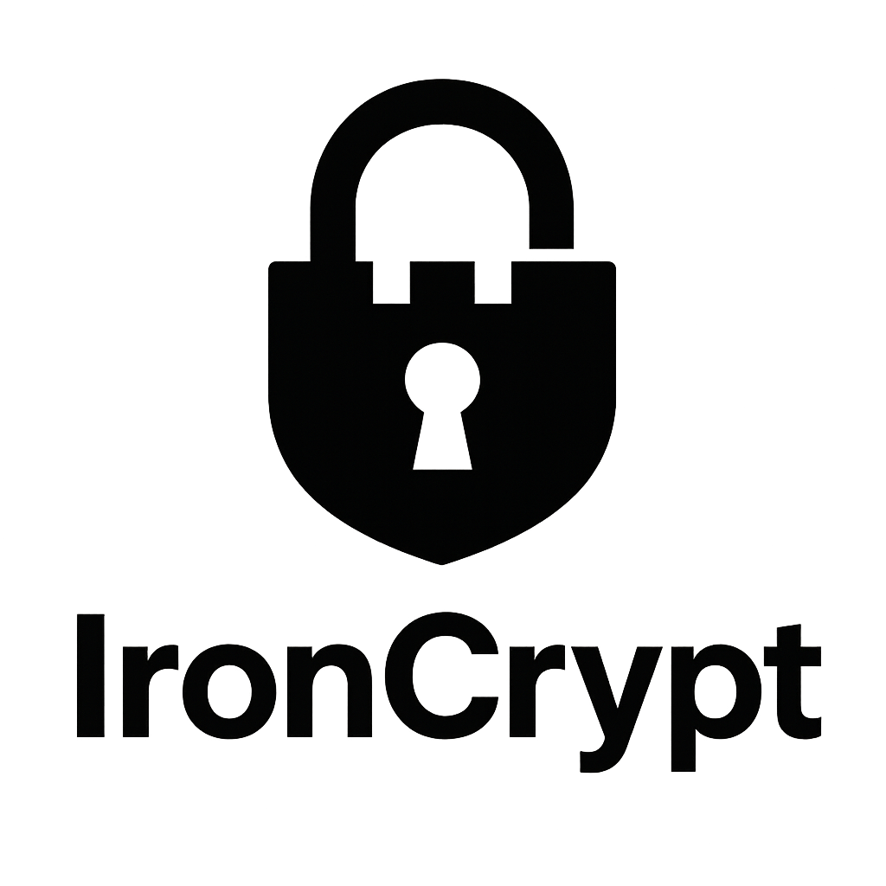

# IronCrypt

- [IronCrypt](#ironcrypt)
  - [Features](#features)
  - [Prerequisites](#prerequisites)
  - [Installation](#installation)
  - [Usage](#usage)
    - [Available Commands](#available-commands)
    - [Below is the general structure of each command.](#below-is-the-general-structure-of-each-command)
    - [Generate](#generate)
    - [Encrypt](#encrypt)
      - [Decrypt](#decrypt)
  - [Examples](#examples)
    - [Generating RSA Keys](#generating-rsa-keys)
    - [Encrypting a Password](#encrypting-a-password)
    - [Decrypting and Verifying a Password](#decrypting-and-verifying-a-password)
    - [Decrypting and Verifying a Password](#decrypting-and-verifying-a-password-1)
  - [Full Example: Password Encryption and Decryption](#full-example-password-encryption-and-decryption)
    - [Steps:](#steps)
  - [Workflows and Architecture Voici deux diagrammes détaillant :](#workflows-and-architecture-voici-deux-diagrammes-d%C3%A9taillant-)
    - [A) Encryption/Decryption Workflow Flowchart:](#a-encryptiondecryption-workflow-flowchart)
  - [Error Handling](#error-handling)
  - [Encrypting and Decrypting Binary Files](#encrypting-and-decrypting-binary-files)
    - [Workflow for Binary Files](#workflow-for-binary-files)
    - [**Encrypt** it:](#encrypt-it)
  - [Table of Commands and Options](#table-of-commands-and-options)
  - [Security and Best Practices](#security-and-best-practices)
  - [Contribution](#contribution)

**IronCrypt** is a Command-Line Interface (CLI) tool and Rust library dedicated to secure password and data encryption. By combining the **Argon2** hashing algorithm, **AES-256-GCM** encryption, and **RSA** for key management, IronCrypt provides a robust solution to ensure your application’s data confidentiality and password security.

---

## Features

- **Hybrid Encryption (RSA + AES):** IronCrypt uses a smart combination of encryption methods. It encrypts your data with AES-256 (very fast and secure), and then encrypts the AES key itself with RSA. This is an industry-standard technique called "envelope encryption" that combines the best of both worlds: the speed of symmetric encryption and the secure key management of asymmetric encryption.
- **State-of-the-Art Password Hashing:** For passwords, IronCrypt uses Argon2, currently considered one of the most secure hashing algorithms in the world. It is specifically designed to resist modern GPU-based brute-force attacks, providing much greater security than older algorithms.
- **Advanced Key Management:** The built-in key versioning system (`-v v1`, `-v v2`) and the dedicated `rotate-key` command allow you to update your encryption keys over time. This automates the process of migrating to a new key without having to manually decrypt and re-encrypt all your data. IronCrypt can load both modern PKCS#8 keys and legacy PKCS#1 keys, ensuring broad compatibility.
- **Flexible Configuration:** You can finely tune security parameters via the `ironcrypt.toml` file, environment variables, or the `IronCryptConfig` struct in code. This includes RSA key size and the computational "costs" of the Argon2 algorithm, allowing you to balance security and performance to fit your needs.
- **Comprehensive Data Encryption:** IronCrypt is built to handle more than just passwords. It can encrypt any file (images, PDFs, documents), entire directories (by archiving them first), or any other data that can be represented as a stream of bytes.
- **Dual Use (CLI and Library):** IronCrypt is designed from the ground up to be dual-purpose. You can use it as a quick command-line tool for simple tasks, or integrate it as a library (crate) directly into your own Rust applications for more complex logic.

---
## Workflow

The following diagram illustrates the general encryption and decryption workflow in IronCrypt:



## Installation and Usage

### Prerequisites

- **Rust** (latest stable version recommended)
- **Cargo** (Rust's package manager)

### Building and Running from Source

There are three main ways to run the `ironcrypt` command-line tool.

#### 1. Using `cargo run` (Recommended for development)
This command compiles and runs the program in one step. Use `--` to separate `cargo`'s arguments from your program's arguments.
```sh
# Clone the repository
git clone https://github.com/teamflp/ironcrypt.git
cd ironcrypt

# Run the --help command
cargo run -- --help
```

#### 2. Building and running the executable directly
You can build the executable and then run it from its path in the `target` directory. Note that on some systems (like macOS), the exact path might include your system's architecture (e.g., `target/x86_64-apple-darwin/release/`).
```sh
# Build the optimized release executable
cargo build --release

# Run it from its path
./target/release/ironcrypt --help
```

#### 3. Installing the binary (Recommended for usage)
This will install the `ironcrypt` command on your system, making it available from any directory. This is the best option for regular use.
```sh
# From the root of the project directory, run:
cargo install --path .

# Now you can use the command from anywhere
ironcrypt --help
```

## Command Reference
A full list of commands and their arguments can be viewed by running `ironcrypt --help`. To get help for a specific command, run `ironcrypt <command> --help`.

### Global Options

| Flag | Environment Variable | Description |
|---|---|---|
| `--format <FORMAT>` | `IRONCRYPT_FORMAT` | Sets the output format. Can be `text` (default) or `json`. |

## Library Usage (Rust)

You can also use `ironcrypt` as a library in your Rust projects. Add it to your `Cargo.toml`:
```toml
[dependencies]
ironcrypt = { git = "https://github.com/teamflp/ironcrypt.git" }
```
For more details on the API, see the [documentation on crates.io](https://crates.io/crates/ironcrypt) (once published) or build the documentation locally with `cargo doc --open`.

## Contributing

Contributions are welcome! If you'd like to contribute, please follow these steps:

1.  **Fork** the repository on GitHub.
2.  **Create** a new branch for your feature or bug fix.
3.  **Commit** your changes and push them to your fork.
4.  **Submit** a pull request with a clear description of your changes.

---
*IronCrypt is licensed under the MIT License. See the [LICENSE](LICENSE) file for details.*